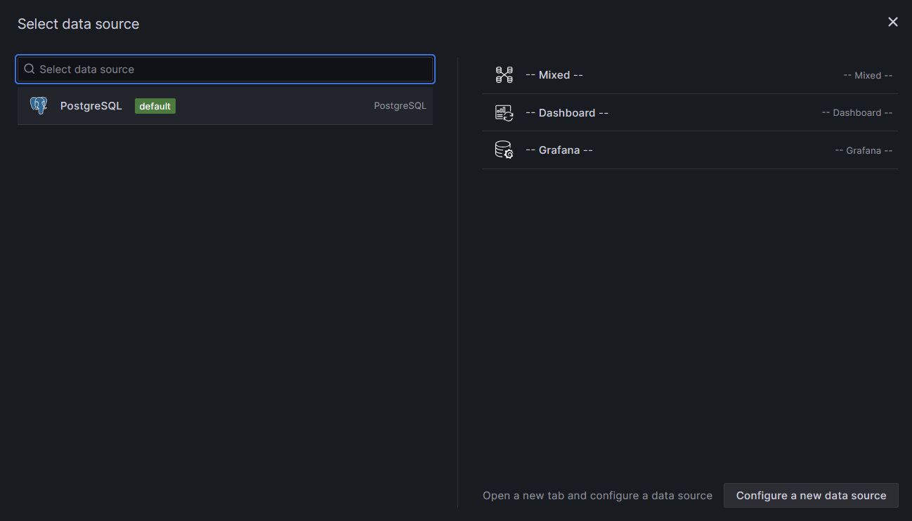

# CCFD
Credit Cards Fraud Detection (CCFD) project aims to identify potential fraud credit card transaction utilising machine learning, and alert the detected transaction on a graph.

This project is a project based learning, utilising: 
- Pyspark
- Pyspark MLlib
- Kafka
- PostgreSQL
- Grafana
- Docker

## Features
- **Data Processing**: Cleans, transforms, and prepares data for analysis.
- **Machine Learning**: Train LogisticRegression, RandomForest, and GradientBoostTree Model, with the processed data and select the best performed model.
- **Realtime Simulation**: Simulate realtime data log with Kafka.
- **Fraud Detection**: Applied the model on realtime data and stored the fraud transaction in PostgreSQL database.
- **Alert System**: Plotting a graph of fraud transaction with grafana as an alert system.


## Requirement
- Docker/ Docker Desktop
- VSCode
- Python

### Datasets used:
https://www.kaggle.com/datasets/kartik2112/fraud-detection?resource=download

## Installation

### Clone the repository:
```bash
git clone https://github.com/ISE-S46/CCFD.git
cd ccfd
```

### Jupyter/Pyspark-notebook Docker Container setup:
```bash
docker build -t pyspark_env .
docker run -d -p 8888:8888 -v ${pwd}:/app -p 4040:4040 --name pyspark_env pyspark_env 
```
### Access JupyterLab at http://localhost:8888 


### Download the datasets
#### Both fruadTest.csv and fruafTrain.csv from
https://www.kaggle.com/datasets/kartik2112/fraud-detection?resource=download

### Preprocess Data:
Run Train_Data_Process.ipynb and Test_Process_Data.ipynb in Jupyterlab then rename .csv file in Test_Process_Data folder as Test_Process_Data.csv and Train_Process_Data folder as Train_Process_Data.csv

Copy Test_Process_Data.csv to kafka folder and Train_Process_Data.csv to outside of Train_Process_Data folder.

### Train Model (Optional):
Run Train_Model.ipynb in JupyterLab and you'll get new fraud_detection_model folder.

Optional: Run Test_Model.ipynb to check model performance.


Replace fraud_detection_model folder in kafka with the new fraud_detection_model folder.

### Grafana, PostgreSQL Docker Container setup:
```bash
docker network create fraud-detection-network
docker-compose -f Database/docker-compose.yml up -d
```

### Kafka, Pysaprk Docker Container setup: 
(if producer-1 container does not start, manually start it again, wait around 10 seconds and it will works.)
```bash
docker-compose -f kafka/docker-compose.yml up -d
```

Check credit-card-transactions topic in Kafka:
```bash
docker exec -it kafka-kafka-1 /bin/bash
```
if there is no credit-card-transactions:
```bash
kafka-topics --create --topic credit-card-transactions --bootstrap-server localhost:9092 --partitions 1 --replication-factor 1
kafka-topics --list --bootstrap-server localhost:9092
```
## Grafana Setup

### Access Grafana at http://localhost:3000
#### In this example, username is admin and password is password.

### Manually add PostgreSQL datasource to grafana:
#### Select Connections -> Data sources -> add new data sources

#### password is password

#### Save & test should look like this


### Creating graph



### After every steps is complete the graph should look like this


