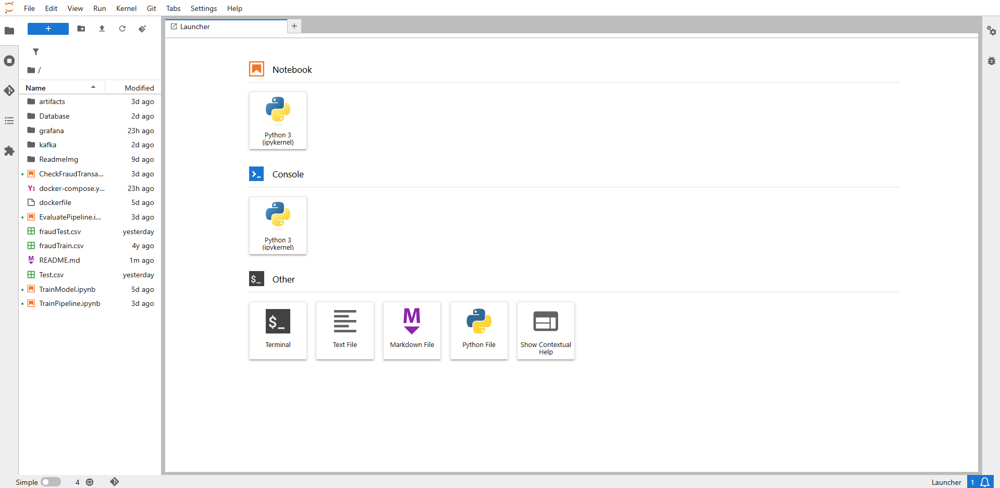

# CCFD
Credit Cards Fraud Detection (CCFD) project aims to identify potential fraud credit card transaction utilising machine learning, and alert the detected transaction on a graph.

Technologies used:
- Pyspark
- Pyspark MLlib
- Kafka
- PostgreSQL
- Grafana
- Docker

## Features
- **Data Processing**: Transforms, and prepares data for analysis.
- **Machine Learning**: Train LogisticRegression, RandomForest, and GradientBoostTree Model, with the processed data.
- **Pipeline Training**: Train Pipeline model based on best performed ML model and processed data.
- **Realtime Simulation**: Simulate realtime data log with Kafka and zookeeper.
- **Fraud Detection**: Applied the pipeline model on realtime data log and stored log and fraud transaction log in seperated PostgreSQL database.
- **Alert System**: Plotting a graph of fraud transaction with grafana as an alert system.


## Requirement
- Docker/ Docker Desktop

### Datasets used:
https://www.kaggle.com/datasets/kartik2112/fraud-detection?resource=download

## Installation

### Clone the repository:
```bash
git clone https://github.com/ISE-S46/CCFD.git
cd ccfd
```

### Jupyter/Pyspark-notebook Docker Container setup (Optional):
#### Run this container if you don't have pyspark installed in your pc 
```bash
docker build -t pyspark_env .
docker run -d -p 8888:8888 -v ${pwd}:/app -p 4040:4040 --name pyspark_env pyspark_env 
```
### Access JupyterLab at http://localhost:8888 


### Download the datasets
#### Both fruafTrain.csv and fruadTest.csv from (Both of these files should be in the root directory of this project)
https://www.kaggle.com/datasets/kartik2112/fraud-detection?resource=download

### Train Model (Optional):
- Run TrainModel.ipynb in JupyterLab or on your local machine.
- Result should give the reason why GradientBoostTree model is chosen for pipeline training.

### Train Pipeline:
- Run TrainPipeline.ipynb in JupyterLab or on your local machine.

### Evaluate Pipeline (Optional):
- Run EvaluatePipeline.ipynb in JupyterLab or on your local machine.


### Docker Containers setup: 
```bash
docker-compose up --build -d
```

### Grafana, PostgreSQL Docker Container setup:
```bash
docker network create fraud-detection-network
docker-compose -f Database/docker-compose.yml up -d
```

## Grafana Setup

### Access Grafana at http://localhost:3000
#### In this example, username is admin and password is password.

### Manually add PostgreSQL datasource to grafana:
#### Select Connections -> Data sources -> add new data sources

#### password is password

#### Save & test should look like this


### Creating graph


### After every steps is complete the graph should look like this


