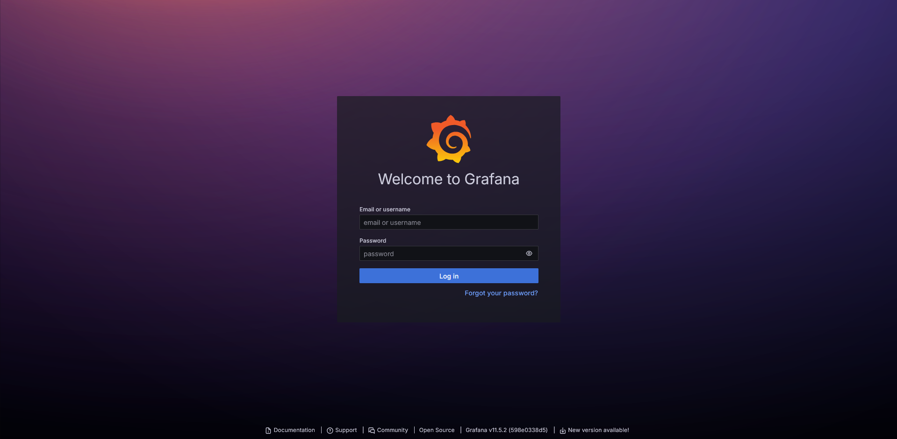
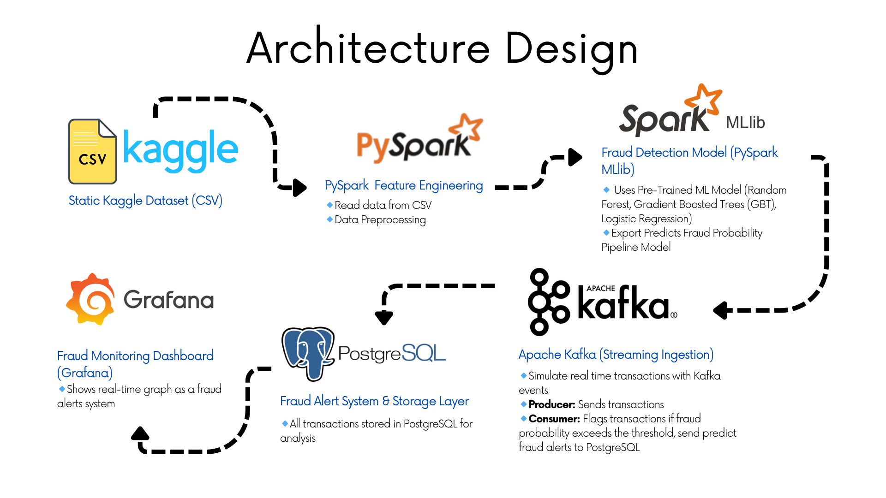

# Credit Card Fraud Detection (CCFD)


A real-time credit card fraud detection system built with PySpark MLlib that processes transactions through Kafka streams and provides live monitoring via Grafana dashboards.


## Features
- **Data Processing**: Transforms, and prepares data for analysis.
- **Machine Learning**: Train LogisticRegression, RandomForest, and GradientBoostTree Model, with the processed data.
- **Pipeline Training**: Train Pipeline model based on the best performed ML model and processed data.
- **Realtime Simulation**: Simulate realtime data log with Kafka and zookeeper.
- **Fraud Detection**: Applied the pipeline model on realtime data log and stored transaction log PostgreSQL database.
    - Every log will be stored in all_transactions table.
    - Only fraud transaction will also be store in fraud_transactions table for easier detection.
- **Alert System**: Plotting a graph of fraud transaction with grafana as an alert system.

## Installation

**Quick Start**: For a minimal setup, you only need to complete steps 1, 4, 6, 7, and 8.

### Prerequisites
- [Docker Desktop](https://www.docker.com/products/docker-desktop/) or Docker
- Download [FraudTest.csv](https://www.kaggle.com/datasets/kartik2112/fraud-detection?resource=download&select=fraudTest.csv) and [FraudTrain.csv](https://www.kaggle.com/datasets/kartik2112/fraud-detection?resource=download&select=fraudTrain.csv)

### 1. Clone the repository:
```bash
git clone https://github.com/ISE-S46/CCFD.git
cd ccfd
```

### 2. (Optional) Jupyter/Pyspark-notebook Docker Container setup:
- Run this container if you don't have pyspark installed in your machine 
```bash
docker build -t pyspark_env .
docker run -d -p 8888:8888 -v ${pwd}:/app -p 4040:4040 --name pyspark_env pyspark_env 
```
- Access JupyterLab at http://localhost:8888 


### 3. (Optional) Train Model:
- Run TrainModel.ipynb in JupyterLab or on your local IDE.
- The result should give the reason why GradientBoostTree model is chosen for pipeline training.

### 4. Train Pipeline:
- Run TrainPipeline.ipynb in JupyterLab or on your local machine.
- Use fraudtrain.csv for pipeline training.

### 5. (Optional) Evaluate Pipeline:
- Run EvaluatePipeline.ipynb in JupyterLab or on your local machine.
- Use fraudTest.csv for evaluation is recommended

### 6. Create .env in root directory
Example .env:
```env
# Kafka and Zookeeper Configuration
ZOOKEEPER_CLIENT_PORT=2181
ZOOKEEPER_TICK_TIME=2000
KAFKA_BROKER_ID=1
KAFKA_ZOOKEEPER_CONNECT=zookeeper:${ZOOKEEPER_CLIENT_PORT}
KAFKA_ADVERTISED_LISTENERS=CLIENT://localhost:9092,INTERNAL://kafka:29092
KAFKA_LISTENERS=CLIENT://0.0.0.0:9092,INTERNAL://0.0.0.0:29092
KAFKA_INTER_BROKER_LISTENER_NAME=INTERNAL
KAFKA_OFFSETS_TOPIC_REPLICATION_FACTOR=1
KAFKA_GROUP_INITIAL_REBALANCE_DELAY_MS=0
KAFKA_AUTO_CREATE_TOPICS_ENABLE=true
KAFKA_TOPIC_NAME=raw_transactions

# Spark Common Configuration
SPARK_MASTER_URL=spark://spark-master:7077
SPARK_RPC_AUTHENTICATION_ENABLED=no
SPARK_RPC_ENCRYPTION_ENABLED=no
SPARK_LOCAL_DIRS=/tmp/spark-events
SPARK_LOG_DIR=/opt/spark/logs
SPARK_SERIALIZER=org.apache.spark.serializer.KryoSerializer
SPARK_KAFKA_PACKAGE_VERSION=4.0.0

# Spark Master
SPARK_MASTER_HOST=spark-master
SPARK_MASTER_PORT=7077
SPARK_MASTER_WEBUI_PORT=8080

# Spark Resource Allocation
SPARK_WORKER_CORES=1
SPARK_WORKER_MEMORY=1G
SPARK_WORKER_WEBUI_PORT=8081
SPARK_DRIVER_MEMORY=1g
SPARK_EXECUTOR_MEMORY=1g
SPARK_EXECUTOR_CORES=1
SPARK_SQL_SHUFFLE_PARTITIONS=2
SPARK_DRIVER_MAX_RESULT_SIZE=1g

# Spark Consumer
SPARK_STREAMING_TRIGGER_TIME=10 seconds
SPARK_STREAMING_MAX_OFFSETS_PER_TRIGGER=1000
CONSUMER_FRAUD_THRESHOLD=0.75
CONSUMER_CHECKPOINT_PATH=/app/spark_checkpoints

# File used for producer
PRODUCER_CSV_FILE=fraudTest.csv # Change this to Test.csv for testing
PRODUCER_SAVE_INTERVAL=50

# PostgreSQL Configuration (replace with whatever you like)
POSTGRES_DB=CCFD_DB
POSTGRES_USER=admin
POSTGRES_PASSWORD=12345
POSTGRES_HOST=postgres # (must be the same as service name in docker-compose.yml)
POSTGRES_PORT=5432

# Grafana Configuration
GRAFANA_ADMIN_USER=admin
GRAFANA_ADMIN_PASSWORD=12345
```

### 7. Docker Containers setup: 
```bash
docker-compose up --build -d
```
### 8. Configure Grafana Dashboard

- Access Grafana at http://localhost:3000
- In this example, username is admin and password is 12345 (From .env configuration).



- Click Toggle Menu button at the top left then select Dashboards.
- Click Create Dashboard, then Add visualization, then select default PostgreSQL datasource as shown below.


- Select Code, then paste this code inside it, then press Run query.
    - Replace actual_system_time with trans_date_trans_time for the real transaction time, drawback is that its harder to create the graph.
```sql
SELECT
  actual_system_time,
  is_fraud
FROM
  all_transactions
WHERE
  $__timeFilter(actual_system_time)
ORDER BY
  actual_system_time
```


- Change panel title to "Fraud Transaction Prediction", and set time range to "Last 15 minutes" should give the result similar to below.
    - This graph is plot with .env credential as below for easier visualization.

    ```env
    PRODUCER_CSV_FILE=Test.csv
    ```


- Press save at the top right and the installation is completed.

## Uninstall / Reinstall
```bash
docker-compose down -v --rmi all

or

docker-compose down --volumes
```


## Technologies Used:
- Pyspark
- Pyspark MLlib
- Python
- Kafka
- PostgreSQL
- Grafana
- Docker

## Architecture Design



## Contributing

Contributions are welcome! If you have suggestions for improvements or bug fixes, please feel free to fork the repository and open a pull request.

## License

See [LICENSE](LICENSE) file for details.